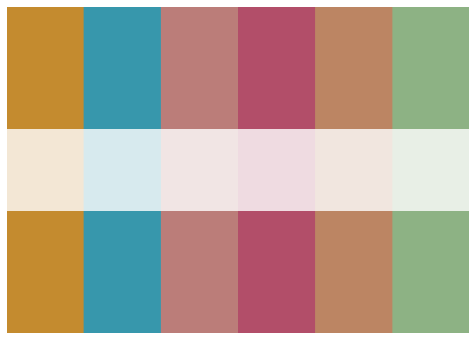
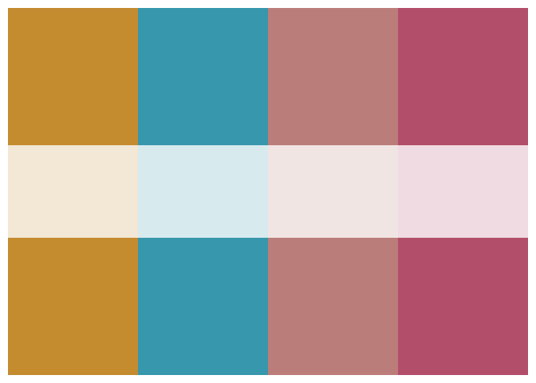
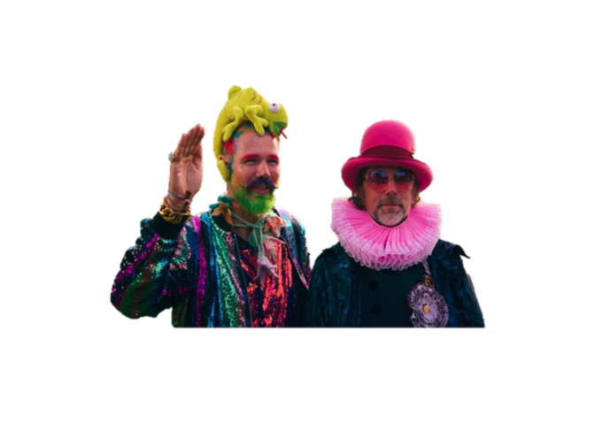
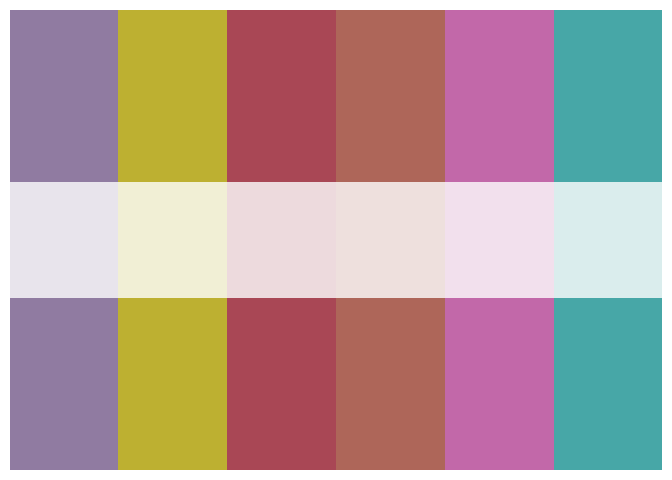

<!-- README.md is generated from README.Rmd. Please edit that file -->

# Yan & Henck Inspo

## Installation

You can install bestinbloom from GitHub with:

``` r
# install.packages("devtools")
devtools::install_github("arsweeny/bestinbloom")
```

## Usage

You can create a palette with the following command, specifying type
(“qual”, “seq”, “div”) Although none of these outfits lend themselves
to much beyond qualitative pals\!

``` r
library(bestinbloom)
```

``` r
pal <- bloom_palette("Episode3", type="qual")
```



If you want a specific number of colors up to 6 (qual), 8 (seq), 9 (div)

``` r
pal <- bloom_palette("Episode3", type="qual", n=4)
```



## Palettes Available

Palettes in this package correspond to each set of outfits in every
episode, named accordingly.

### Episode 1


### Episode 2


### Episode 3


### Episode 4


### Episode 5


### Episode 6


### Episode 7


### Finale


